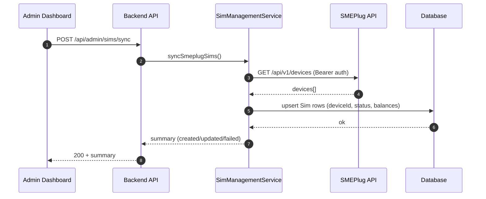
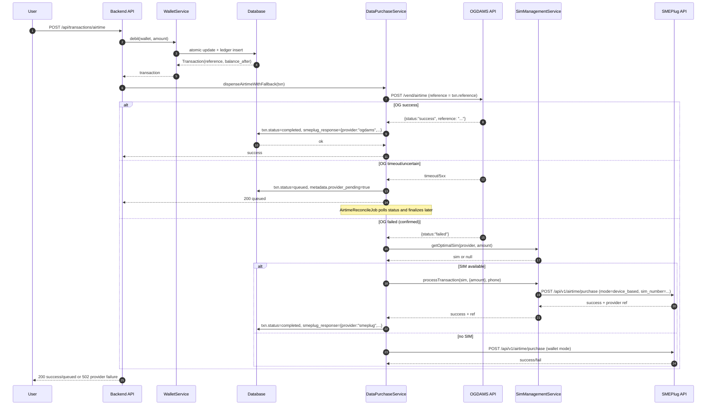
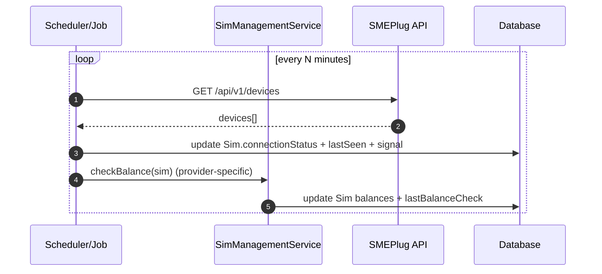
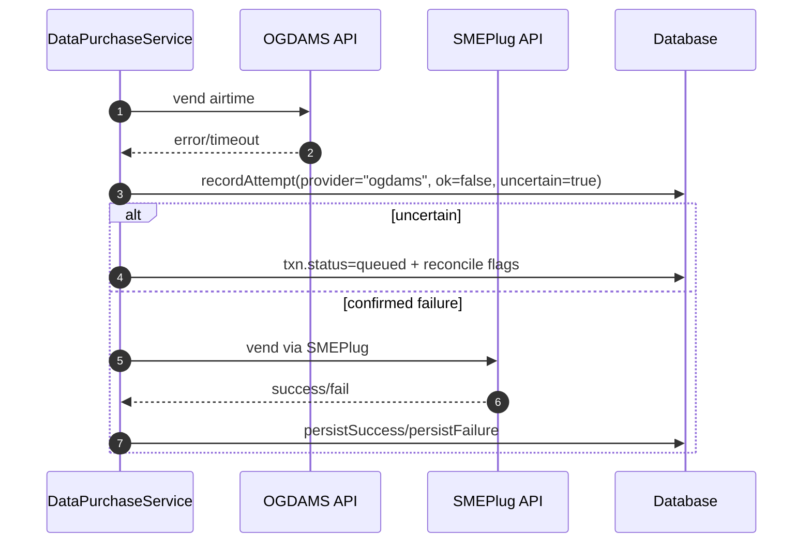

# Real-Time SIM Communication Architecture (OGDAMS + SMEPlug)

This document defines the end-to-end communication architecture for establishing, managing, and maintaining reliable near-real-time data exchange with SIM resources through:

- **SMEPlug** (SIM “devices” + vending APIs + optional transaction status checks)
- **OGDAMS** (vendor API for airtime vend + status checks; not a SIM connectivity layer)

It reflects the current codebase structure and provides implementation guidelines to scale to thousands of SIMs and high transaction throughput.

## 1) Components and Roles

### 1.1 Internal Services (this application)

- **API Gateway (Express)**
  - Public + authenticated endpoints for purchases and admin operations.
  - Webhook endpoints for provider callbacks.
- **Transaction Orchestrator**
  - Airtime/data purchases route through [transactionController.js](file:///c:/Users/7410/peace%20bundle/backend/controllers/transactionController.js) and [dataPurchaseService.js](file:///c:/Users/7410/peace%20bundle/backend/services/dataPurchaseService.js).
- **SIM Fleet Manager**
  - SIM inventory, selection, and “device-based” routing:
  - [simManagementService.js](file:///c:/Users/7410/peace%20bundle/backend/services/simManagementService.js)
- **Wallet Ledger**
  - Atomic credit/debit with transaction ledger:
  - [walletService.js](file:///c:/Users/7410/peace%20bundle/backend/services/walletService.js)
- **Background Jobs**
  - SIM balance checks: [checkSimBalanceJob.js](file:///c:/Users/7410/peace%20bundle/backend/jobs/checkSimBalanceJob.js)
  - Airtime reconciliation worker: [airtimeReconcileJob.js](file:///c:/Users/7410/peace%20bundle/backend/jobs/airtimeReconcileJob.js)
  - Virtual account provisioning: [virtualAccountProvisioningJob.js](file:///c:/Users/7410/peace%20bundle/backend/jobs/virtualAccountProvisioningJob.js)
- **Monitoring/Audit**
  - Provider webhook audit trail (example: BillStack funding): [WebhookEvent.js](file:///c:/Users/7410/peace%20bundle/backend/models/WebhookEvent.js)

### 1.2 External Providers

- **SMEPlug**
  - HTTPS REST API for:
    - Device inventory (`/api/v1/devices`)
    - Vend airtime/data (`/api/v1/airtime/purchase`, `/api/v1/data/purchase`)
    - Transaction status (`/api/v1/transactions/:ref`)
  - Client: [smeplugService.js](file:///c:/Users/7410/peace%20bundle/backend/services/smeplugService.js)
- **OGDAMS**
  - HTTPS REST API for airtime vend and optional status polling.
  - Client: [ogdamsService.js](file:///c:/Users/7410/peace%20bundle/backend/services/ogdamsService.js)

## 2) Protocol Stack

- **Transport:** HTTPS (TLS 1.2+), outbound from server to providers.
- **Application Protocol:** JSON over HTTP.
- **Authentication:**
  - SMEPlug: `Authorization: Bearer <apiKey|secretKey>` + optional `Public-Key`.
  - OGDAMS: `Authorization: Bearer <apiKey>`.
- **Inbound provider → app callbacks:** HTTPS webhooks (where supported).
- **Internal real-time to UI:** Socket.IO notifications exist for user notifications (not SIM devices):
  - [notificationRealtimeService.js](file:///c:/Users/7410/peace%20bundle/backend/services/notificationRealtimeService.js)

## 3) Internal API Endpoints (SIM + Purchases)

### 3.1 Purchases

- `POST /api/transactions/airtime`
  - Debits wallet, routes to provider(s), persists transaction state.
  - Provider fallback and reconciliation in [dataPurchaseService.js](file:///c:/Users/7410/peace%20bundle/backend/services/dataPurchaseService.js).

### 3.2 SIM Fleet Management (Admin)

- Admin SIM endpoints are wired in [adminRoutes.js](file:///c:/Users/7410/peace%20bundle/backend/routes/adminRoutes.js) and handled by controllers like [simController.js](file:///c:/Users/7410/peace%20bundle/backend/controllers/simController.js).
- SMEPlug SIM sync is implemented as a fleet import:
  - `syncSmeplugSims()` in [simManagementService.js](file:///c:/Users/7410/peace%20bundle/backend/services/simManagementService.js)

### 3.3 Webhooks

- `POST /api/webhooks/smeplug` (status updates)
- `POST /api/webhooks/*` (funding gateways, etc.)
- Routing: [webhookRoutes.js](file:///c:/Users/7410/peace%20bundle/backend/routes/webhookRoutes.js)

## 4) Message Formats

### 4.1 SMEPlug vend request (airtime)

```json
{
  "network_id": 1,
  "phone": "08012345678",
  "phone_number": "08012345678",
  "amount": 500,
  "mode": "device_based",
  "sim_number": "0803xxxxxxx"
}
```

### 4.2 OGDAMS vend request (airtime)

```json
{
  "networkId": 1,
  "amount": 500,
  "phoneNumber": "08012345678",
  "type": "VTU",
  "reference": "WLT-XXXXXXXXXXXX"
}
```

### 4.3 Internal transaction state (ledger)

- `Transaction.reference` is globally unique.
- Provider attempts and outcomes are appended to `Transaction.metadata.provider_attempts`.
- Final provider response is stored in `Transaction.smeplug_response` as `{ provider, data }`.

## 5) Connection Model (What “SIM Connection” Means Here)

This system does **not** keep a persistent TCP/WebSocket link to physical SIM hardware from the backend.
Instead:

- “Connected SIM” means the **provider** reports the device is online (SMEPlug device inventory).
- The backend maintains a **fleet registry** (`Sim` records) with:
  - `deviceId`, `imei`, `connectionStatus` (“connected/disconnected”), last seen, balances, etc.
- Operationally, “real-time” is achieved via:
  - **Low-latency provider APIs** for vending
  - **Polling/heartbeat** for fleet health (device status + balances)
  - **Webhooks** for asynchronous provider status updates where available

## 6) Sequence Diagrams (Mermaid)

### 6.1 Handshake / Fleet Sync (SMEPlug → Local SIM Registry)



### 6.2 Airtime Purchase (Primary OGdams, Fallback SMEPlug device route)



### 6.3 Heartbeat / Health Monitoring (Fleet)



### 6.4 Failover (OGdams → SMEPlug)



## 7) Error Handling, Retry Logic, and Idempotency

### 7.1 Outbound retries

- SMEPlug client already retries on DNS/timeouts with base URL fallback (`.ng` → `.com`): [smeplugService.js](file:///c:/Users/7410/peace%20bundle/backend/services/smeplugService.js#L174-L233)
- OGDAMS client uses request timeouts and structured errors: [ogdamsService.js](file:///c:/Users/7410/peace%20bundle/backend/services/ogdamsService.js)

### 7.2 Idempotency

- All purchase flows must use `Transaction.reference` as the idempotency key when calling providers.
- Webhook processing must be idempotent; funding is enforced by unique `Transaction.reference` (already unique in schema).

### 7.3 “Uncertain state” handling

- When a provider may have processed the transaction but the API call failed (timeouts/5xx):
  - Mark transaction `queued`
  - Schedule reconciliation checks (status polling)
  - [dataPurchaseService.js](file:///c:/Users/7410/peace%20bundle/backend/services/dataPurchaseService.js#L34-L131)
  - Worker: [airtimeReconcileJob.js](file:///c:/Users/7410/peace%20bundle/backend/jobs/airtimeReconcileJob.js)

## 8) Connection Pooling and Concurrency Control

### 8.1 HTTP keep-alive

For high throughput, use keep-alive Agents for outbound HTTPS to providers:

- Node `https.Agent({ keepAlive: true, maxSockets: <N> })`
- Reuse a single axios instance per provider with agent configured.

### 8.2 Rate limiting + quota

- Per-provider request budgets to avoid bans:
  - SMEPlug: cap concurrent vends per second; implement a token bucket.
  - OGdams: cap concurrent vends and status polls.
- Per-SIM quotas:
  - Daily dispense limit (already supported via `sim_daily_limit` setting in [simManagementService.js](file:///c:/Users/7410/peace%20bundle/backend/services/simManagementService.js#L563-L579))

### 8.3 Handling thousands of SIMs

- Store and update SIM metadata:
  - `deviceId`, `lastSeen`, signal, balances
- Heartbeat strategy:
  - Poll device list every 30–60s (batch)
  - Poll per-device details only for “hot” devices (recently used) to reduce load
- Balance checking:
  - Cache within 5 minutes (already present)
  - Stagger checks (shard SIMs into batches)
- Transaction routing:
  - Select optimal SIM by load + balance (already present)
  - Add distributed locks if multiple app instances run concurrently

## 9) Monitoring Requirements

- **Request/Response logging**
  - Include `Transaction.reference`, provider, latency, status.
- **Metrics**
  - Success/failure rate per provider
  - p50/p95 latency per provider endpoint
  - Queue depth of `queued` transactions
  - SIM fleet health: connected %, low-balance %, banned %
- **Audit trails**
  - WebhookEvent table for inbound webhook attempts (provider, verified, processed, error)
- **Alerting**
  - Provider error spikes
  - Queue depth above threshold
  - SIM connectivity drops

## 10) Security Requirements

- TLS 1.2+ for all provider connections.
- Secrets in env vars only; rotate keys regularly:
  - `SMEPLUG_API_KEY`, `SMEPLUG_SECRET_KEY`, `OGDAMS_API_KEY`
- Webhook signature verification for inbound callbacks; allowlist provider IPs where supported.
- PII minimization in logs:
  - Mask phone numbers and account numbers.
- SIM authentication protocols:
  - Device identity is anchored by provider-issued `deviceId` and optionally `imei`.
  - Do not trust user-submitted SIM identifiers without server-side verification.

## 11) Expected Benchmarks and Scalability Constraints

### 11.1 Latency targets (guidelines)

- Provider vend p50: < 1.5s
- Provider vend p95: < 4s
- Internal API response p95 (including wallet debit + enqueue/confirm): < 2s
- Reconciliation completion for queued transactions: < 60s typical, < 5 min worst-case

### 11.2 Throughput targets (guidelines)

- 10–50 vends/sec per provider account without throttling (depends on provider policy).
- 1k–10k SIM inventory supported via:
  - batched polling
  - sharded workers
  - controlled concurrency

### 11.3 Service degradation

- If OGdams is down:
  - Route via SMEPlug API/device path immediately
  - Or queue for reconcile if state is uncertain
- If SMEPlug is down:
  - Route via OGdams if available
  - Reduce SIM-based routing; degrade to “wallet mode” if supported
- If both are down:
  - Reject new vends with clear 5xx + maintain wallet safety (no double debit, offer refund workflow)

